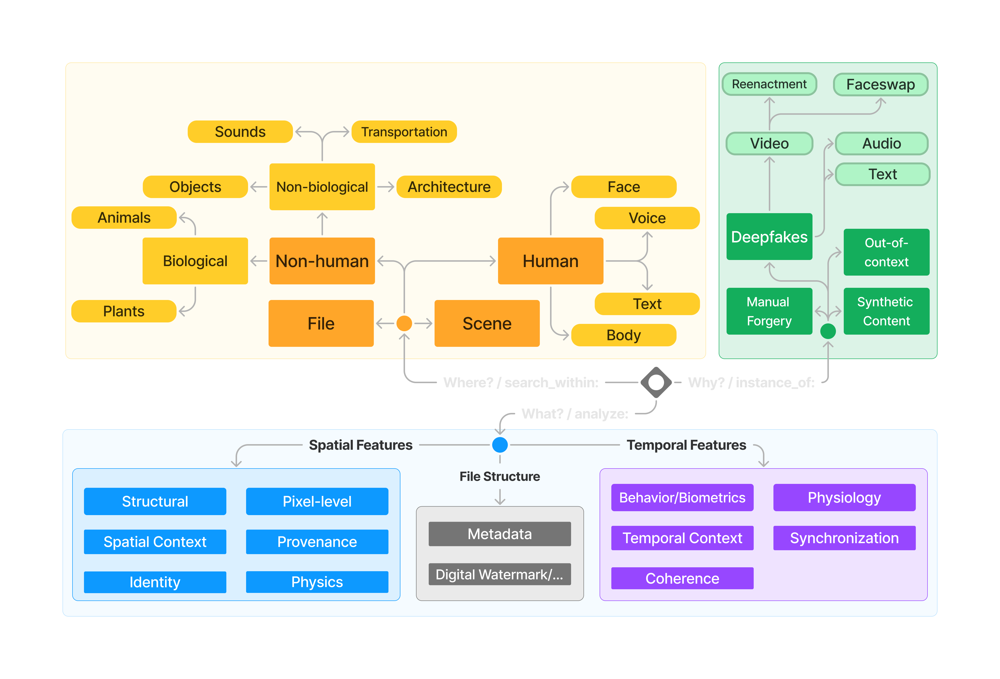

<!--
 Varuna Ontology (c) by DeFake Project
 
 Varuna Ontology is licensed under a
 Creative Commons Attribution 4.0 International License.
 
 You should have received a copy of the license along with this
 work. If not, see <https://creativecommons.org/licenses/by/4.0/>.
-->

# Varuna | DeFake Project


Varuna is a project that aims to develop a usable and highly interpretable way to interact with the vast space of digital media forensics through an ontological framework that can be used to organize the state-of-the-art analytic tools and models.

## Why Varuna?
The project is named after the Hindu god of water, Varuna, who is the guardian of the cosmic order. The project aims to bring order to the chaotic world of digital media forensics by organizing the tools and models in a structured manner. The project is part of the [DeFake project](https://defake.app/about), which aims to develop a platform for detecting deepfakes and other forms of disinformation.

## What is Varuna Ontology?
Varuna is an ontology that consists of the following three main components:
- **Why** are you analyzing the media? This component includes the motivations/hypothesis behind the analysis. *For example, you might want to analyze a video to detect deepfakes or to verify the authenticity of the video.*
- **What** features do you want to use for the analysis? This component includes the features you may want the analytic to use and is geared towards more expert users. *For example, you may want to use facial landmarks or SRM features for the analysis.*
- **Where** do you want the analytic to look ? This component includes the regions of interest (ROIs) you may want the analytic to focus on. It is also a simpler way to understand possible limitations of an analytic. *For example, you may want the analytic to focus on the face or the background of the video.*



The above figure shows the initial state of the Varuna ontology project that is more oriented towards the analysis of AI manipulated media, like deepfakes. The ontology is still in the development phase and will be updated as the project progresses. This is where the community can contribute by suggesting changes and additions to the ontology.

Read more about the beginnings of this project in the [blog post](https://blog.defake.app/building-a-more-explainable-analyst-centered-deepfake-detection-tool/) on the DeFake website.

You can also view the ontology in an interactive node graph format by clicking <<*under construction*>>.

## Organized Analytics
The above ontology will can be referred to to tag each analytic tool or model with the relevant components for each of the three core components. This would allow the users to search for the tools based on the components they are interested and more importantly, it would allow the users to understand the tools better by looking at the components they are tagged with.

## How to contribute?
The Varuna project is open-source and welcomes contributions from the community. 

### Discord Server Path
The project has a dedicated Discord server where the community can discuss the project and contribute to it. Although at the end of the day the contributions would still need to go through the GitHub PR process, the community allows a more streamlined way to discuss the changes and get feedback.

We vet our community members to ensure that they are not malicious actors. If you are interested in contributing to the project, please fill up the following [form](https://docs.google.com/forms/d/e/1FAIpQLSfuiLu2DKN4PdyRvat7zz0RWVBi53me8jY-6h82mlFE4lSKGQ/viewform?usp=sf_link) and we will get back to you with the Discord server link.

### Direct GitHub Contribution Path
The project contains two core JSON files for the ontology nodes and edges that you can find under [src\data](https://github.com/nviable/varuna/tree/master/src/data) in this repository. If you are not interested in joining the Discord server, you can still contribute to the project by directly making a pull request to the GitHub repository or raising an issue. You can read up proper instructions on how exactly to contribute changes in [src\data](https://github.com/nviable/varuna/tree/master/src/data).

## Interactive Pages
The project currently showcases two interactive pages that allow the users to interact with the ontology. 

### Searchable Analytics List
[This page](https://dim-fontology.vercel.app/analytics) allows the users to search for the analytics based using a fuzzy search.

### Ontology Sentece Builder
[This page](https://dim-fontology.vercel.app/ontology) allows the users to build a sentence based on the components of the ontology. This is our prototype of a intuitive user-friendly way to interact with the ontology.

### Interactive Node Graph
This page is under construction and will allow the users to interact with the ontology in a node graph format.

## How to run the project locally?
The project is built using Next.js and can be run locally by following the steps below:

This is a [Next.js](https://nextjs.org/) project bootstrapped with [`create-next-app`](https://github.com/vercel/next.js/tree/canary/packages/create-next-app).

### Getting Started

First, run the development server:

```bash
npm run dev
# or
yarn dev
# or
pnpm dev
# or
bun dev
```

Open [http://localhost:3000](http://localhost:3000) with your browser to see the result.

### Learn More

To learn more about Next.js, take a look at the following resources:

- [Next.js Documentation](https://nextjs.org/docs) - learn about Next.js features and API.
- [Learn Next.js](https://nextjs.org/learn) - an interactive Next.js tutorial.

You can check out [the Next.js GitHub repository](https://github.com/vercel/next.js/) - your feedback and contributions are welcome!
